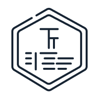

  

<h1 align="center">TokenTrek</h1>

 

<h2>About</h2>

TokenTrek is an application for tracking changes in cryptocurrency prices in real time.

<h2>Tech Stack</h2>

<ul>
  <a href="https://github.com/SnapKit/SnapKit"><li>SnapKit</li></a>
  <a href="https://github.com/Moya/Moya"><li>Moya</li></a>
  <a href="https://github.com/danielgindi/Charts"><li>Charts</li></a>
  <a href="https://firebase.google.com"><li>Firebase</li></a>
  <li>CoreData</li>
</ul>

<h2>Dependencies</h2>

To set up dependencies, run `pod install`.
